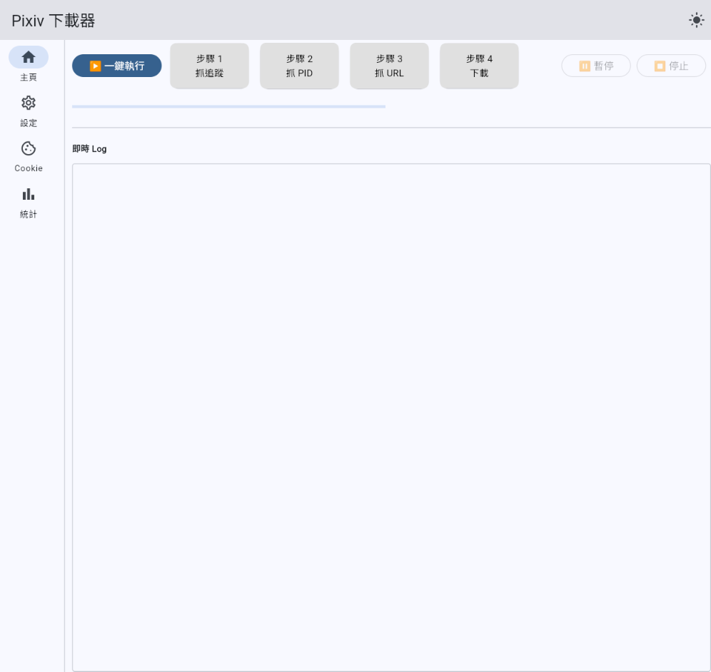
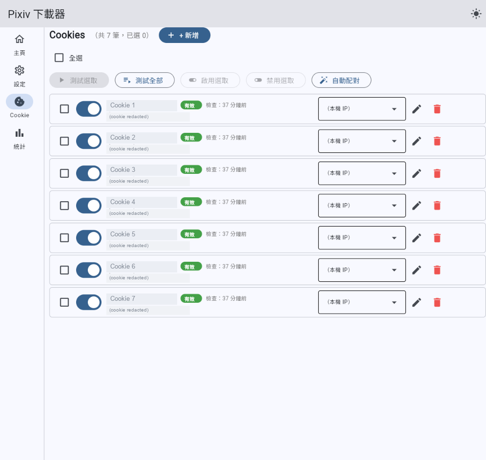
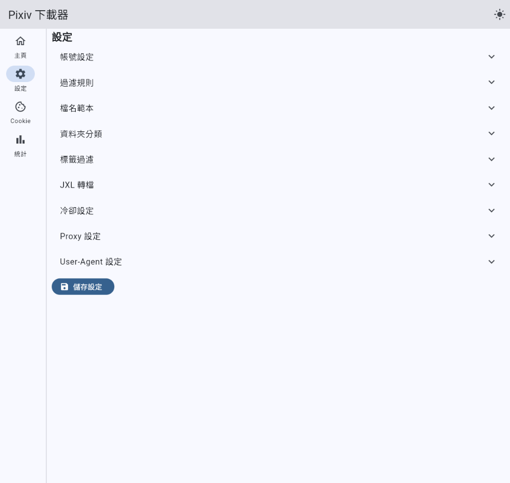
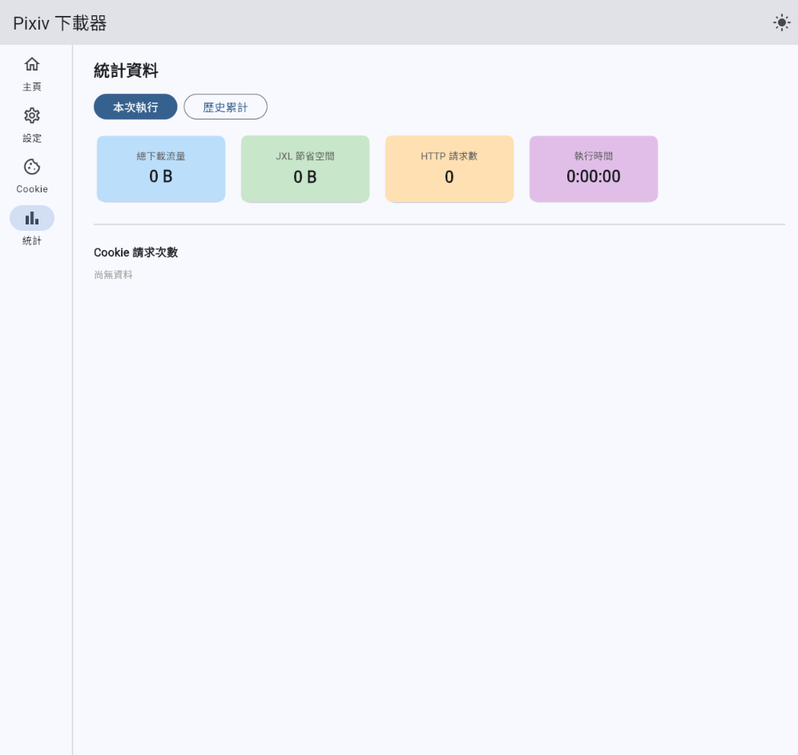
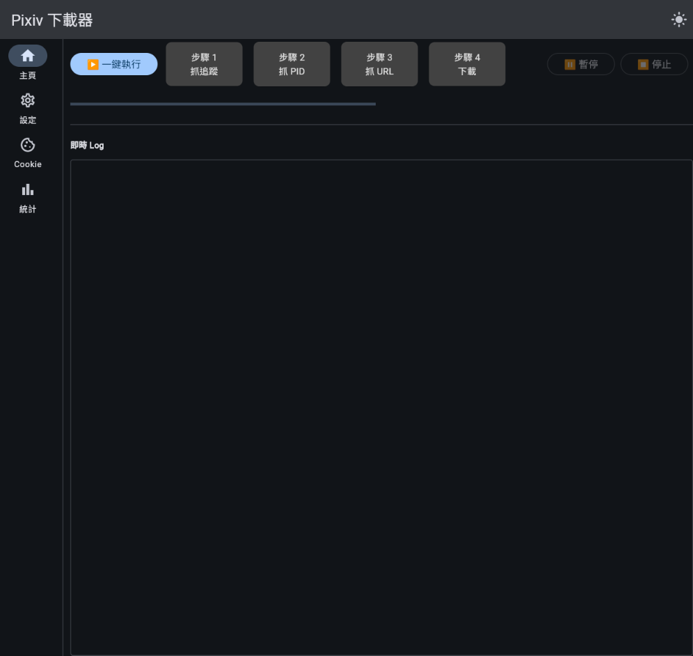

# pixiv-batch-download

> Pixiv 批次下載器 — 以 **Flet（Material 3）** 重構，支援桌面、網頁，以及無 GUI 的 **CLI / 排程** 模式。
>
> *Pixiv batch downloader rebuilt with Flet (Material 3): desktop, web, and a headless CLI + scheduler.*



---

## 功能概覽 Features

### 工作流程 Pipeline

- 4 步驟管線：步驟 1（追蹤畫師）→ 步驟 2（抓 PID）→ 步驟 3（抓 URL / 元資料）→ 步驟 4（下載）
- 一鍵執行全流程（Run All）
- 每個步驟均可獨立暫停 / 繼續 / 停止
- **邊查邊下（合併步驟 3＋4）**：開啟 `download.combined_mode` 後，每抓到一個 PID 的元資料就立刻下載該作品的所有頁面，「查」與「下」共用同一個帳號冷卻窗口 —— 更快看到結果、更少落地 IO、請求節奏更平均。可自動吸收先前只跑了一半的步驟 3 進度，無需手動遷移。
- **依作者順序下載**：開啟 `download.author_order` 後，步驟 4 會把同一位作者的作品連續下載完（PID 由大到小，未知作者排最後）再換下一位。

### 無 GUI：CLI 與排程 Headless CLI & Scheduler

- `python cli.py …` 可在不開視窗的情況下驅動同一套管線，方便自動化或讓腳本 / LLM 呼叫：
  - `run --step {1,2,3,4,combined,all}` — 執行單一步驟、合併模式或全流程
  - `status [--json]` — 輸出待下載 / 已下載 / 失敗 / 已撤銷頁數與元資料筆數
  - `config get|set <section>.<field> [value] [--json]` — 讀寫設定
  - `cookie test [--json]` — 測試所有已設定 Cookie 的有效性
  - `following export [--json]` — 匯出追蹤畫師清單
  - 慣例：`--json` 結果寫入 **stdout**，所有人類可讀日誌寫入 **stderr**，並回傳有意義的 exit code（適合自動化 / LLM）。
- **App 內建排程器**：在設定頁的「排程」開啟後，App 會在背景依「每日固定時間」或「固定間隔」自動觸發 Run All；若已有任務在執行則自動略過該次。

### Cookie 池與帳號排程

- 多組 Cookie 輪替，每組可設定別名與有效性測試（結果可快取 30 天免重測）
- `AccountScheduler`：冷卻時間依 `avg × ln(N+1)` 自動計算，並以節流閘把請求間隔控制在 ±10% 內，避免觸發限速
- 每組 Cookie 可獨立綁定 Proxy（`http://`、`https://`、`socks5://`），同一帳號永遠走同一個出口 IP

### 篩選規則

- 必須 tag / 禁止 tag（Chip 標籤，即時增刪）
- 一般 / R18 作品各自設定最低讚數門檻，支援特殊規則（per-tag 不同閾值）
- 篩選掉的結果保留在 SQLite，換條件重跑無需重新抓取

### 資料夾組織

- 依作者 ID 建立子資料夾
- R-18 / R-18G / AI 生成作品各自分類至獨立子資料夾
- 支援自訂檔名範本（`{timetag}_PID{pid}{page}{hashtag}.{ext}` 等佔位符；可選擇清理標籤中的括號 / 特殊字元）

### JXL 後處理（選用）

- 下載完成後自動用 `cjxl.exe` 轉換為 JPEG XL（無損）
- 可指定 effort（1–9）；不設定則自動搜尋已知安裝路徑
- 缺少 `cjxl.exe` 不影響下載（功能為選用）

### 統計面板

- 本次 / 累計下載數、失敗數、運行時長
- 各 Cookie 帳號下載量長條圖（即時更新）

### 可靠性 Reliability

- 遭遇 `ProxyError` / `ConnectTimeout` / `ConnectionError` 時，自動每 60 秒重試最多 5 次，全部失敗才停用該 Cookie
- 所有設定與進度透過 `safe_io.atomic_write_*` 寫入，最多保留 10 份歷史備份
- 規範資料庫為 `metadata.sqlite3`（WAL）；每次執行前自動備份（官方 backup API）
- **事件日誌 + 崩潰回復**：每筆資料庫變更會先寫入 `events/*.jsonl`，啟動時若偵測到上次未正常結束會自動 `recover_tail` 補齊；亦可用 `tools/replay_events.py` 從快照重建

---

## 系統需求 Requirements

- Windows 10 / 11，Python 3.10+

```bash
pip install flet "requests[socks]"
```

> `flet` 內建 Dart runtime，無需額外安裝。
> 需要 SOCKS5 proxy 支援時，務必安裝 `requests[socks]`。
> CLI 與排程器僅用標準函式庫（`argparse` / `threading`），無額外相依。
> JXL 轉換為選用功能，需另外下載 `cjxl.exe`（[libjxl 官方 release](https://github.com/libjxl/libjxl/releases)）。

---

## 執行方式 Usage

**桌面模式（預設）：**

```bash
python main.py
```

**網頁模式（瀏覽器開啟）：**

```bash
flet run app/gui/flet_app.py --web
```

**無 GUI / CLI 模式：**

```bash
python cli.py run --step all          # 1 → 2 → 3/邊查邊下 → 4
python cli.py run --step combined     # 只跑「邊查邊下」（合併步驟 3＋4）
python cli.py status --json           # 查詢目前進度（JSON）
python cli.py config set download.combined_mode true
python cli.py config get download.like_num --json
python cli.py cookie test --json
python cli.py following export
```

> CLI 與 GUI 共用 `%APPDATA%/pixiv_download/` 下的同一份狀態與設定。

---

## 典型使用流程 Typical Workflow

1. **設定**頁面：填寫 User ID、下載路徑、篩選規則、冷卻時間；視需要開啟「邊查邊下」「依作者順序下載」或「排程」。
2. **Cookie** 頁面：新增 Cookie 字串，點選測試有效性，視需要綁定 Proxy。
3. **主頁**：依序執行步驟 1 → 4，或直接按「一鍵執行」。
4. **統計**頁面：查看即時進度與各帳號分配情況。

---

## 專案結構 Project Structure

```
cli.py                   # CLI 入口（python cli.py …）
main.py                  # GUI 入口（shim → app.entry.main）
app/
  entry/main.py          # Flet 啟動入口
  gui/
    flet_app.py          # 主視窗、NavigationRail、EventDispatcher、排程器啟動、崩潰回復
    dispatcher.py        # 事件佇列 → UI 回調（每 50ms 輪詢）
    run_actions.py       # RunController：組裝 AccountScheduler 並啟動執行緒（含合併模式路由）
    views/
      main_view.py       # 步驟卡片、進度列、日誌面板
      settings_view.py   # 設定頁（ExpansionTile 分組，含「排程」「邊查邊下」開關）
      cookies_view.py    # Cookie 池管理
      stats_view.py      # 統計面板
  cli/
    headless_view.py     # 無 GUI 的 RunController view stub
    headless_runner.py   # run_headless()：事件佇列 pump + Run-All 串接
    commands.py          # argparse 子指令（run/status/config/cookie/following）
  core/
    pixiv_thread_base.py # PauseableThread 基底（pause/resume/stop/retry）
    thread_following.py  # 步驟 1：抓追蹤畫師列表
    thread_pid_scan.py   # 步驟 2：抓作品 PID
    thread_url_fetch.py  # 步驟 3：抓圖片 URL / 元資料
    thread_download.py   # 步驟 4：下載圖片 / GIF（含依作者排序）
    thread_combined.py   # 邊查邊下：組合步驟 3＋4 的單執行緒協調器
    account_scheduler.py # 多帳號冷卻排程（round-robin）
    scheduler_service.py # App 內建定時排程器（compute_next_fire + 背景執行緒）
    metadata_db.py       # SQLite 元資料 + 待下載佇列 + 視圖
    event_log.py         # 事件日誌 + 崩潰回復（recover_tail）
    pixiv_api.py         # Pixiv HTTP 封裝
    settings_store.py    # 統一 settings.json 設定讀寫
    safe_io.py           # 原子寫入 + 歷史備份
    stats_collector.py   # 統計收集器
```

---

## 資料儲存位置 Data Location

執行期設定與進度存於 `%APPDATA%/pixiv_download/`：

| 路徑 | 說明 |
|------|------|
| `settings.json` | 統一設定（下載路徑、篩選、冷卻、Cookie 池、Proxy、排程等；舊版多檔會自動遷移合併） |
| `metadata.sqlite3` | 規範資料庫：PID 元資料、逐頁下載狀態、待下載 / 已下載 / 失敗 / 撤銷 |
| `events/*.jsonl` | 事件日誌（崩潰回復用，按日期 + 大小輪替） |
| `history/` | `safe_io` 與資料庫快照的歷史備份，命名格式 `filename.YYYYMMDD(.N)`，最多保留 10 份 |
| `pictures_id.txt` / `all_url.txt` / `err_url.txt` | 相容用的文字檔；規範狀態以 SQLite 為準 |

---

## 開發指引 Development

```bash
# 單元測試（整合測試不會自動排除；加 -m 'not integration' 可略過）
pytest
pytest -m integration          # 需要網路 / 真實 Cookie 的整合測試

# 程式碼品質
ruff check app/                # E/F/UP/B/SIM
radon cc app/ -n C -s
lizard -C 15 -L 100 app/
```

> 開發前請先閱讀 `CLAUDE.md`（架構、資料庫 schema、事件日誌、各功能設計細節）以及
> `.claude/skills/flet-0-84-pitfalls/SKILL.md`（PyQt5 → Flet 0.84 遷移踩過的雷）。

---

## 截圖 Screenshots

### 主畫面 — 4 步驟管線 + 一鍵執行


### Cookie 管理 — 多帳號輪替 + Proxy 綁定


> 圖中 alias 與 cookie 內容已遮蓋；實際使用會顯示你自訂的別名與最後檢查時間。

### 設定 — ExpansionTile 分組


### 統計面板 — 流量、JXL 節省空間、HTTP 請求、Cookie 分配


### 深色模式


> 右上角單鍵切換 LIGHT / DARK / SYSTEM，選擇透過 `SettingsStore` 持久化；所有 view 即時重新著色不需重啟。

---

## 注意事項 Notes

- 請遵守 Pixiv 服務條款及當地法律。
- 存取限制內容需要有效的登入 Cookie。
- 若遭遇頻率限制，請調高平均冷卻秒數（建議 ≥ 30 秒）。
