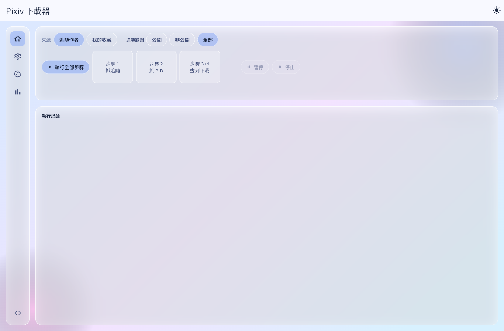
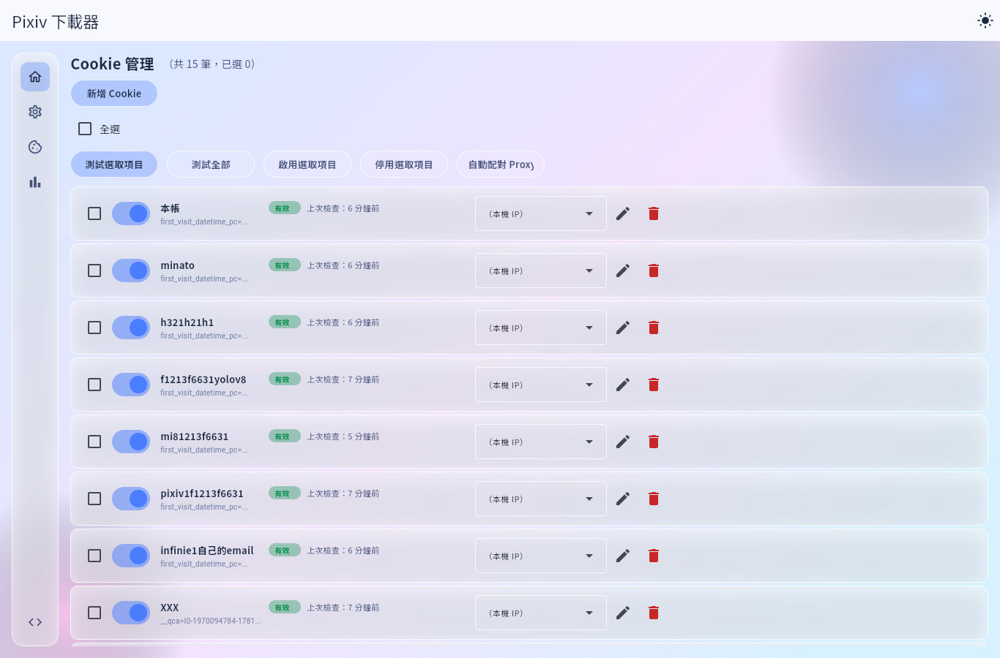
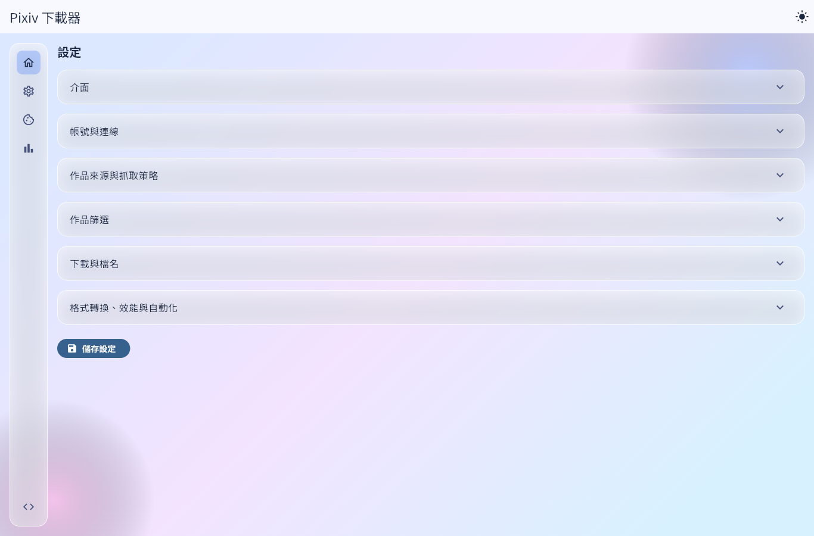
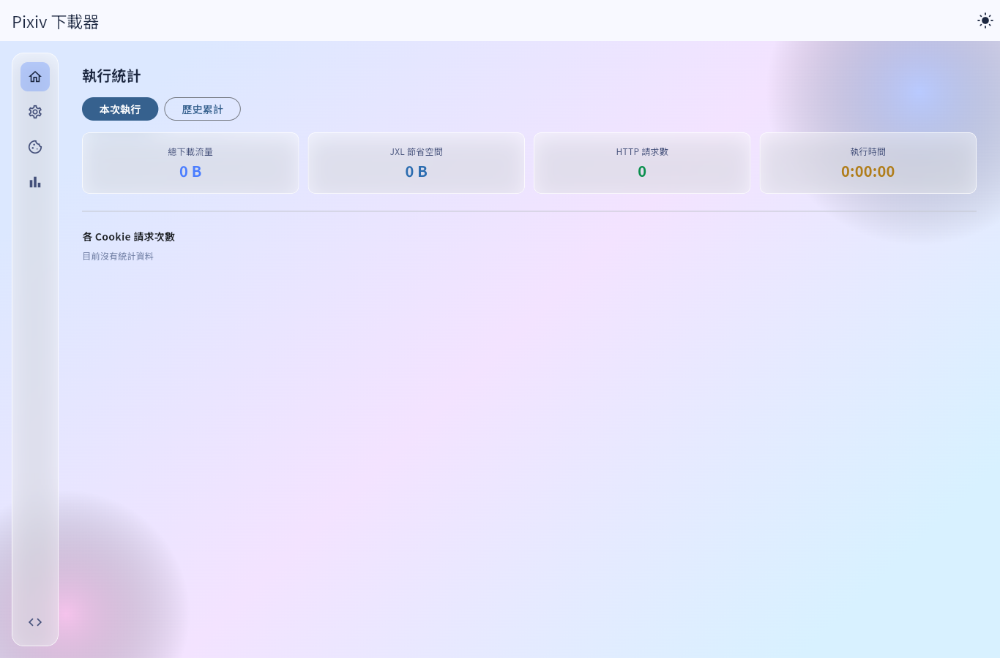

# 我寫了一個支援多 Cookies 輪換的 Pixiv 圖片下載器

這是我大二時開始寫的一個 Pixiv 圖片下載器。最早其實只是閒著沒事，想省一點手動存圖的時間，所以就寫了一個很簡單的版本。結果後來功能越加越多，慢慢變成現在這個樣子。

老實說，這個專案裡面還是有不少歷史包袱。早期寫法比較粗糙，很多功能也是邊用邊補，所以如果真的遇到 bug，也只能說請見諒。

不過最近重新整理時，感受到現在的 AI 工具真的進步很多。以前可能要花一個月慢慢改的東西，現在靠 Claude 協助整理和重構，3天內就能改完。
寫這個主要是單獨放到github好像沒有什麼流量，多點人來當我debug工程師也好www
## 專案地址 
https://github.com/Eric25741629/pixiv_follower_download

## 應用畫面

## 為什麼會做多 Cookies 輪換

一開始我也是用單一帳號 Cookie 下載。少量使用時還好，但只要任務一多，問題就很明顯：所有請求都集中在同一個帳號上，跑久了很容易出事。

Pixiv 對這類自動化存取本來就有風險。以我的經驗來說，如果同一個帳號在短時間內送出太多請求，可能會先收到警告，繼續不當使用甚至可能導致帳號被封。

我自己的本帳就曾經因為這樣消失，所以後來才開始認真想：能不能不要讓所有請求都壓在同一組 Cookie 上？

這也是這個工具後來會往「多 Cookies 輪換」發展的原因。與其把所有工作都丟給同一組 Cookie，不如建立一個 Cookie 池，讓不同帳號分擔任務，同時搭配冷卻時間，讓整體節奏比較好控制。

目前這個工具可以放多組 Cookie 進去，幫每組 Cookie 取別名、開關啟用狀態、測試是否有效，也可以幫不同 Cookie 綁定不同 Proxy。

實際執行下載時，程式會在這些 Cookie 之間輪流使用，而不是一直拿同一組 Cookie 去打所有請求。

## 它不是單純照順序輪流用

多 Cookies 聽起來好像只是「第一組用完換第二組」，但實際上我希望它跑起來更穩一點，所以裡面有做一個帳號排程器。

每組 Cookie 用完一次後會進入冷卻時間。程式會看哪些 Cookie 目前可以用、哪些還在冷卻、哪些閒置比較久，再決定下一次要用哪一組。

這樣做的好處是，請求比較不會永遠集中在清單前面的帳號，也比較不容易因為某一組 Cookie 掛掉，就讓整個任務直接卡死。

如果某組 Cookie 綁定的 Proxy 連不上，程式也會在當輪任務先把它停用，避免一直重試同一個壞掉的來源。

## 目前可以做的事

這個工具現在大致分成四個步驟：

1. 抓追蹤畫師或收藏來源。
2. 掃描作品 PID。
3. 抓圖片 URL 和作品資訊。
4. 下載圖片或動圖。

可以一步一步跑，也可以直接按「執行全部步驟」。如果開啟「邊查邊下」，它會在抓到作品資訊後就直接下載，不用等所有 URL 都整理完才開始。

主畫面會顯示目前跑到哪一步、整體進度、正在處理的 PID 和執行紀錄。比起以前只有終端機輸出，現在至少比較知道程式到底在忙什麼。

## 篩選和整理也一起做了

下載多了之後，另一個麻煩點就是整理。

所以我後來也加了一些設定，例如必須包含的 tag、要排除的 tag、一般作品和 R18 作品各自的最低讚數門檻。被篩掉的資料不會直接丟掉，而是會留在 SQLite 裡，之後改條件時不用全部重抓。

下載後也可以依作者 ID 分資料夾，R-18、R-18G、AI 生成作品也能分開放。檔名可以用範本組出 PID、頁碼、時間標記和 hashtag，避免大量圖片全部擠在同一個資料夾裡。

## 不只 GUI，也可以用 CLI 跑

雖然現在有 Flet 做的圖形介面，但我還是保留了 CLI。

有些時候我只是想讓它在背景跑，或是之後接排程、自動化腳本，CLI 會方便很多。現在可以用指令執行某個步驟、跑完整流程、查狀態、改設定，也可以測試 Cookie。

應用內也有排程功能，可以設定每天固定時間或每隔一段時間自動跑一次。如果當下已經有任務在跑，它會跳過那次，不會硬開第二個任務。

## 統計頁面

我也做了一個簡單的統計頁，可以看本次下載量、HTTP 請求數、執行時間，以及每個 Cookie 大概分到多少請求。

這個頁面對多 Cookies 輪換滿有用的，因為可以直觀看到請求是不是有分散出去，而不是不小心又集中到某一組 Cookie 上。

## 後來最花時間的其實是穩定性

一開始以為下載器最難的是抓圖，後來才發現真正麻煩的是「不要重複下載」、「中斷後能不能接著跑」、「資料不要寫到一半壞掉」。

所以後面加了 SQLite 來記錄作品資料和下載狀態，也把設定和進度改成比較安全的寫入方式。現在就算跑到一半中斷，也比較不容易整個重來。

另外還有事件日誌和崩潰回復機制，用來補救一些意外中斷時沒寫完的狀態。這些東西平常不太會被看到，但真的跑長任務時就很重要。

## 技術上用了什麼

這個專案主要是 Python。GUI 用 Flet，核心下載邏輯放在 `app/core`，介面在 `app/gui`，CLI 則在 `app/cli`。

現在也有不少測試，像 Cookie 排程、設定儲存、下載流程、事件日誌、資料庫狀態和 GUI 更新都有覆蓋一些。對這種慢慢長大的個人專案來說，有測試真的比較敢改。

## 總結

如果只看功能，它就是一個 Pixiv 圖片下載器。但我自己比較在意的是，它已經不是單純把圖片抓下來而已，而是開始處理長時間批次任務會遇到的問題。

多 Cookies 輪換是這個工具目前最核心的特色。它讓下載任務不再完全依賴單一 Cookie，也讓整體節奏比較好控制。

未來應該會想要加入去掉下載下來的馬賽克圖片吧 畢竟目標主要是圖片 廣告什麼的就不用佔用空間了

## 免責聲明

這個專案主要是個人學習、研究和作品展示用途。使用時還是要自行遵守 Pixiv 的服務條款、著作權規範，以及所在地區的法律。

下載到的圖片和作品權利仍然屬於原作者或權利人。請不要拿去未授權散布、商業使用、二次上傳，或做其他可能侵害權利人的用途。

多 Cookies 輪換、Proxy 綁定和排程功能，是為了讓長時間任務比較好管理，不是鼓勵高頻率存取、規避平台限制或影響服務穩定。

使用這個工具造成的帳號風險、資料遺失或其他後果，都需要由使用者自行承擔。

使用這個工具造成的帳號風險、資料遺失或其他後果，都需要由使用者自行承擔。

使用這個工具造成的帳號風險、資料遺失或其他後果，都需要由使用者自行承擔。